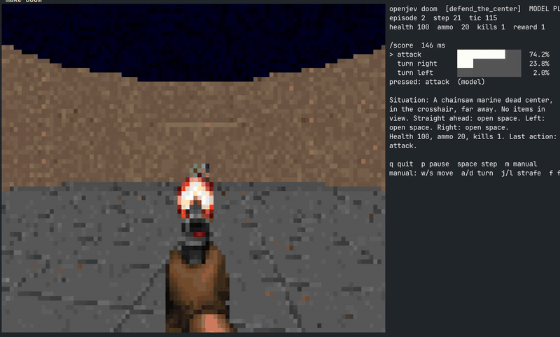

# openjev

> **Disclaimer:** This project was inspired by [vinnylarouge/jevlike](https://github.com/vinnylarouge/jevlike). It is an independent reimplementation and is not affiliated with or endorsed by the original author.



*Live demo: the local model scores the available actions each frame. [Full-resolution video (.mov)](docs/media/doom-recording.mov).*

One-pass option scoring with a local Gemma 3 4B on Apple silicon via MLX.
Design notes: [docs/one-pass-option-scoring.md](docs/one-pass-option-scoring.md).

Given a context and a list of pre-written options, the model prefills the
context once, expands that KV cache across the option batch, and scores every
option in a single padded forward pass. No decoding. The score is the
log-probability of the option tokens given the context; a softmax over the
option scores gives a probability per option, like `jevlike-predict`.

## Setup

```sh
make setup       # uv sync (arm64 Python 3.12 venv) + download google/gemma-3-4b-it into models/ (gated; needs HF login)
make serve       # start the HTTP server on :8000
make health      # curl /health
make request     # example curl against /score
make check       # verify cached batched scoring against naive re-encoding
make bench       # latency benchmark
make eval DATA=data/synthetic/test.jsonl
make doom        # play Doom in the terminal with the server choosing every action (see demo/doom/)
```

`make setup` also installs the optional `torch` extra, used only for the jevlike comparison and HF cross-checks.

## Usage

```sh
# Rank options for one context (prints probability, score, raw sum, token count)
.venv/bin/openjev score --context "The capital of France is" \
    --option " Paris" --option " Berlin" --option " Lyon"

# Chat template (context as user turn, options scored as the reply) + PMI normalisation
.venv/bin/openjev score --chat --norm pmi --context "..." --option "..." --option "..."

# Top-1 / top-3 accuracy on jevlike-style JSONL: {"context": ..., "options": [...], "label": 0}
.venv/bin/openjev eval data.jsonl --norm mean

# Predefined options: one per line in a text file, reused for every context
.venv/bin/openjev score --options-file options.txt --context "..."
.venv/bin/openjev eval contexts.jsonl --fixed-options options.txt   # rows need only {"context": ...}; add "label" for accuracy

# Verify the cached batched path against naive re-encoding, and benchmark it
.venv/bin/openjev check
.venv/bin/openjev bench --context-tokens 200 --options 8 --option-tokens 30
```

## Server

Loads the model once and answers scoring requests in about 90 ms each. Runs natively on macOS with
Metal; there is no container path because Linux containers cannot reach the Apple GPU.

```sh
make serve                                     # = .venv/bin/openjev serve --port 8000  (GET /health, POST /score)
curl -s localhost:8000/score -H 'content-type: application/json' -d '{
  "context": "Customer: my order arrived broken. Agent:",
  "options": [" I am sorry, I will send a replacement.", " Please read our returns policy."],
  "norm": "mean", "chat": false, "sep": ""
}'
```

The response has `best`, `best_index`, per-option `probability` / `logprob_sum` / `n_tokens`, and `timing`.

## TypeSafe System One contract

`POST /v1/systemone` implements the request/response shape documented at
[docs.typesafe.ai](https://docs.typesafe.ai): a `state` (string, object or array) plus a map of typed
`questions`, answered "in parallel and in isolation" against that state.

```sh
make systemone     # example request; or:
curl -s localhost:8000/v1/systemone -H 'content-type: application/json' -d '{
  "state": "I ordered size 10 shoes but received size 8. Please send the right size.",
  "model": "jev-latest",
  "questions": {
    "department":  {"type": "choice", "instructions": "Which department handles this?",
                    "criteria": {"returns": "Returns and exchanges", "shipping": "Delivery issues", "billing": "Charges and refunds"}},
    "severity":    {"type": "score",  "instructions": "How severe is the problem?",
                    "criteria": ["minor", "moderate: wrong item", "major: safety or financial loss"]},
    "wants_refund":{"type": "noul",   "instructions": "Is the customer asking for a refund to their card?"}
  }
}'
```

| question `type` | request `criteria` | answer fields |
|---|---|---|
| `choice` | map of option name to description (string, object, array or null); up to 255 options | `choice`, `probabilities` (sum to 1), `confidence` |
| `score` | ordered array of level descriptions | `score` (probability-weighted mean of level index), `probabilities` keyed `"0".."n-1"`, `legend`, `confidence` |
| `noul` | optional `{"true": ..., "false": ...}` | `noul` = probability of yes |

Response: `{"model", "answers": {id: answer}, "usage": {"input_tokens", "output_tokens"}}`.
Set `OPENJEV_API_KEY` before `make serve` to require `Authorization: Bearer <key>` on this route.

How it maps onto the scorer: each question is rendered to a plain-text prompt (state, instructions,
options or levels, then `Answer:`) and the option names, level numbers, or `yes`/`no` are scored as
continuations in one prefix-shared batched pass per question. `confidence` is 1 minus the normalised
entropy of the distribution; TypeSafe does not publish its formula, so treat it as an approximation.
`usage.output_tokens` counts the candidate-label tokens that were scored (nothing is generated).

Comparison on the docs' quick-start request (`examples/systemone-quickstart.json`, a customer whose
Stripe integration has failed for three days), Gemma 3 4B zero-shot vs the numbers TypeSafe publishes
for Jev:

| answer | Jev (docs) | openjev / Gemma 3 4B |
|---|---|---|
| `department.choice` | technical, p=0.84, confidence 0.60 | technical, p=1.00, confidence 1.00 |
| `frustration.score` | 1.04 (annoyed but polite) | 2.00 (furious) |
| `is_urgent.noul` | 0.999 | 0.005 |

Same routing decision, but Gemma is over-confident and disagrees on the two judgement calls. That is
the zero-shot ceiling described in docs/one-pass-option-scoring.md; Jev is a model trained and
calibrated for these questions. Closing the gap means labelled data and a trained head (Route A).

Python:

```python
from openjev import OptionScorer
s = OptionScorer("models/gemma-3-4b-it", batch_size=8)
for r in s.score("The capital of France is", [" Paris", " Berlin"], norm="mean"):
    print(r.option, r.probability, r.logprob_sum, r.n_tokens)
print(s.last_timing)
```

### Normalisation (`--norm`)

| norm | score | use when |
|---|---|---|
| `mean` (default) | sum of option-token log-probs divided by token count | options differ in length |
| `sum` | total log-prob | options are the same length or you want raw likelihood |
| `pmi` | sum minus the option's unconditional log-prob (BOS-only context) | options differ in base-rate plausibility; costs one extra batched pass |

## Measured on M5 Pro, 64 GB (bf16, mlx-lm)

Workload: 202-token context, 8 options, 242 option tokens total.

| path | median latency |
|---|---|
| context cached once, options batched | 0.17 s |
| context re-encoded per option, no cache | 0.68 s |

Model load is about 1 s from a warm disk. First forward pass adds under a second of warm-up.

## Layout

- `openjev/scorer.py`: `OptionScorer` (prefill, cache expansion, batched scoring, naive reference).
- `openjev/cli.py`: `openjev score | eval | bench | check`.
- `models/`: downloaded weights (git-ignored).

## Validating against jevlike

`jevlike` is installed into the same venv (`uv pip install -e ../../vinnylarouge/jevlike`), so both
CLIs read the same JSONL. Generate its synthetic menu set, then score it both ways:

```sh
.venv/bin/jevlike-data synthetic --output data/synthetic
.venv/bin/openjev eval data/synthetic/test.jsonl --norm sum --sep $'\nChoice: '
.venv/bin/jevlike-train data/synthetic/train.jsonl --validation data/synthetic/validation.jsonl \
    --output runs/synthetic-tiny.pt --device mps
.venv/bin/jevlike-eval runs/synthetic-tiny.pt data/synthetic/test.jsonl --device mps
```

Results on the 400-row synthetic test set (2026-09-16):

| scorer | training | top-1 | top-3 | median latency / example |
|---|---|---|---|---|
| openjev, Gemma 3 4B zero-shot, `--norm sum` | none | 1.000 | 1.000 | 0.086 s |
| openjev, `--norm mean` | none | 0.988 | 1.000 | 0.086 s |
| openjev, `--norm pmi` | none | 0.988 | 1.000 | 0.153 s |
| jevlike tiny byte encoder + head | 2000 rows, 8 epochs | 0.998 | 1.000 | well under 10 ms |

The synthetic task is easy for both. The real validation is your own labelled rows: run
`openjev eval` on them zero-shot and compare against a `jevlike-train`/`jevlike-eval` run on the
same split. If Gemma zero-shot is close to the trained head, Route B is enough; if not, train a head
(Route A) with Gemma or a smaller model as the frozen encoder.

## Demo: Doom in the terminal

`demo/doom/` runs ViZDoom headless, describes each frame in a line of text, and
lets the server rank the action menu with one `/score` call (or one System One
`choice` question). Start `make serve`, then `make doom`. Details and keys in
[demo/doom/README.md](demo/doom/README.md).
